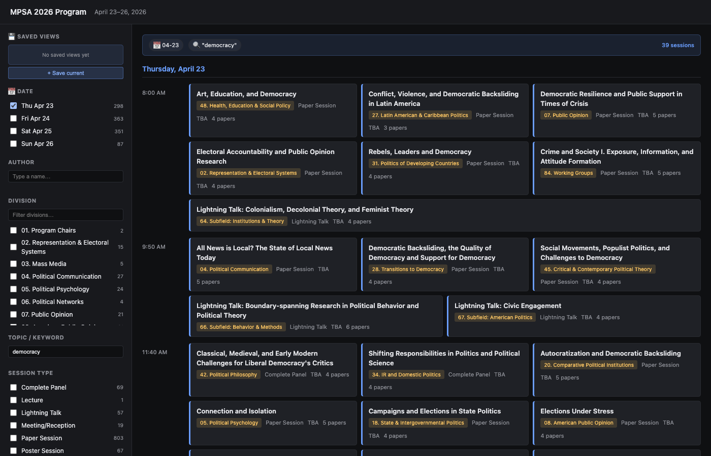

# MPSA 2026 Program Viewer

A local HTML + CSS + JavaScript viewer for the **83rd Annual Midwest Political Science Association Conference** (April 23–26, 2026). Filter 1,099 sessions by date, author, division, topic keyword, or session type; see same-time parallel sessions side-by-side in a time-slot timeline; click a card to expand chair/discussant/papers/authors inline; save filter combinations as named *Saved Views* that persist across reloads.



## What it does

- **Filter** MPSA sessions by **date**, **author**, **division**, **topic keyword**, and **session type**. Category-internal OR, across-category AND. Keyword search tokenizes on whitespace (all tokens must match somewhere in title/paper titles/author names).
- **Timeline view** — results are grouped by day, then by start time; same-time parallel sessions are laid out side-by-side so you can see conflicts at a glance.
- **Inline details** — click any session card to expand Chair, Co-Chair, Discussant, Participants, and the full list of papers with authors + affiliations. The expansion happens in place; neighboring cards in the same time slot are not disturbed.
- **Saved Views** — save any filter combination under a name, switch between multiple saved views, detect when the active view has been edited, update it in place or save as new, rename/delete from the sidebar.
- **Favorites** — click the ★ on any session card to mark it as a favorite, then toggle "Show favorites only" in the sidebar to build a personal schedule view.
- **Persistent** — all filter state, saved views, and favorites are stored in `localStorage`. Close the tab and reopen later; everything comes back.
- **Backup / restore** — use the Export button in the sidebar footer to download a JSON snapshot of your saved views, favorites, and filter state. Import the same file on another browser or after clearing your cache to restore everything. Put the backup in Dropbox / iCloud / Google Drive to carry your setup between machines.

## Repository layout

```
mpsa-viewer/
├── index.html                          # Single-page entrypoint
├── css/main.css                        # All styles
├── js/
│   ├── storage.js                      # localStorage wrapper (filters + presets)
│   ├── filters.js                      # FilterState shape + match logic
│   ├── search.js                       # People index for author autocomplete
│   ├── render.js                       # DOM rendering (main + sidebar + summary)
│   └── app.js                          # Bootstrap + event wiring
├── data/
│   └── program.json                    # Generated by parser (gitignored)
├── scripts/
│   ├── parse_mpsa.py                   # HTML → JSON parser (offline, one-shot)
│   └── fetch_details.py                # Bulk-fetcher for session detail pages
├── raw_html/                           # Your dumped HTML (gitignored, not committed)
│   ├── day1-2026-04-23.html            # 4 day-listing dumps (manual)
│   ├── day2-2026-04-24.html
│   ├── day3-2026-04-25.html
│   ├── day4-2026-04-26.html
│   └── details/                        # 1,099 per-session detail files
│       └── session_<id>.html
├── tests/
│   ├── python/test_parser.py           # 52 tests (unittest)
│   ├── js/
│   │   ├── test_runner.mjs             # Shared sandbox loader
│   │   ├── storage.test.mjs            # 10 tests (node:test)
│   │   ├── filters.test.mjs            # 13 tests (node:test)
│   │   └── search.test.mjs             # 5 tests (node:test)
│   └── fixtures/                       # sample_session.html + program-sample.json
└── docs/
    └── superpowers/
        ├── specs/                      # Design spec
        ├── plans/                      # Implementation plan
        └── notes/parser-structure.md   # HTML selector reference
```

## Setup (first-time)

### 1. Install Python dependencies

```bash
pip install beautifulsoup4 lxml
```

That's the only dependency. Node is only needed if you want to run the JS module tests; the viewer itself has zero runtime dependencies.

### 2. Dump the MPSA day listings

The allacademic "Browse by Day" listing pages require a session cookie, so you must dump them from your browser:

1. Open the MPSA 2026 program in your browser and log in if prompted
2. Navigate to the **Thursday 2026-04-23** "Browse by Day" page
3. Scroll to the bottom to ensure the full day is loaded (in case of lazy-loading)
4. Open DevTools → Console (Cmd/Ctrl + Opt + J) and run:
   ```js
   copy(document.documentElement.outerHTML)
   ```
5. Paste the clipboard contents into `raw_html/day1-2026-04-23.html`
6. Repeat for the other three days:
   - Friday 2026-04-24 → `raw_html/day2-2026-04-24.html`
   - Saturday 2026-04-25 → `raw_html/day3-2026-04-25.html`
   - Sunday 2026-04-26 → `raw_html/day4-2026-04-26.html`

### 3. Bulk-fetch the session detail pages

The listing pages only contain shallow metadata. Run the bulk fetcher to download the 1,099 full detail pages (chair, discussants, papers, authors):

```bash
python3 scripts/fetch_details.py
```

This reads the 4 day listings, extracts session IDs, and fetches each detail page from the public `online_program_direct_link` endpoint with 10 parallel workers. First run takes ~5 minutes. Files land in `raw_html/details/session_<id>.html`. Re-running is idempotent — already-fetched files are skipped.

### 4. Parse everything into `data/program.json`

```bash
python3 scripts/parse_mpsa.py --pretty --out data/program.json
```

You should see:
```
[parse_mpsa] reading 1099 detail files...
[parse_mpsa] parsed 1099 sessions (0 skipped)
[parse_mpsa] wrote data/program.json (2579 KB)
```

### 5. Serve the viewer

`index.html` loads `data/program.json` via `fetch()`, which does not work when opening the file directly in a browser (CORS blocks `file://` requests). Use a simple static server:

```bash
python3 -m http.server 8000
```

Then open <http://localhost:8000> in your browser.

## Running tests

**Python parser tests:**
```bash
python3 -m unittest tests.python.test_parser -v
```

Expected: 52 tests pass.

**JavaScript module tests** (Node ≥ 18):
```bash
node --test tests/js/storage.test.mjs tests/js/filters.test.mjs tests/js/search.test.mjs
```

Expected: 28 tests pass.

`render.js` and `app.js` are not unit-tested — they're DOM code verified by the browser smoke test.

## Re-running when MPSA updates the program

If the MPSA site publishes program updates (room assignments, schedule changes, late additions), re-run the data collection:

1. Re-dump the 4 day-listing HTML files from your browser
2. Delete `raw_html/details/` (optional — fetcher skips unchanged files, but deleting forces a clean re-fetch)
3. `python3 scripts/fetch_details.py`
4. `python3 scripts/parse_mpsa.py --pretty --out data/program.json`
5. Reload <http://localhost:8000>

Your Saved Views and filter state are stored in browser localStorage, so they survive re-parsing.

## Notes

- All session rooms are "TBA" in the current dump — MPSA typically assigns rooms closer to the conference date. The parser captures the field and the UI displays it; when real rooms appear, re-fetching + re-parsing picks them up automatically.
- The sidebar **Topic / Keyword** input tokenizes on whitespace and requires *all* tokens to match somewhere in the session's text (title + paper titles + participant names). No quoted phrases, no regex — keep it short.
- "Saved Views" and filters are private to your browser; nothing is sent off-device.

## License / data

This is a local client for browsing a publicly-accessible conference program. Session titles, abstracts, author names, and affiliations are the property of the respective authors and the MPSA organization. Do not redistribute the `raw_html/` or `data/program.json` files — always collect fresh data from the source.
